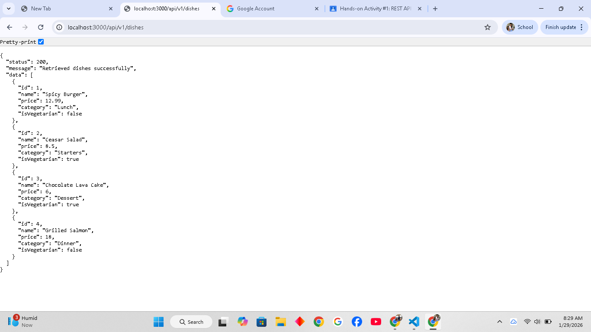

# RESTful API Activity - [MacutongKristelAnneL._3D]

## Best Practices Implementation

**1. Environment Variables**
Question: Why did we put BASE URI in .env instead of hardcoding it?  
Answer:
We use environment variables for the BASE URI to make the application flexible and secure.  
- It allows different environments (development, testing, production) to use different endpoints without changing the code.  
- It prevents sensitive data like API keys or database URIs from being exposed in the code.

**2. Resource Modeling**
Question: Why did we use plural nouns (e.g., `/dishes`) for our routes?  
Answer:  
Using plural nouns is a REST convention that represents collections of resources.  
- It makes URLs intuitive and consistent (e.g., `/dishes` contains multiple dish objects).  
- Singular nouns are usually reserved for accessing one specific resource (e.g., `/dish/1`).

 **3. Status Codes**
Question 1: When do we use `201 Created` vs `200 OK`?  
Answer: 
- `201 Created` → Used when a new resource is successfully created (e.g., POST `/dishes`)  
- `200 OK` → Used when a request successfully retrieves data or updates an existing resource (e.g., GET or PUT requests)

-- Why is it important to return `404` instead of just an empty array or a generic error? --
Answer:
Returning `404 Not Found` clearly informs the client that the requested resource does not exist.  
- It helps revent confusion between “resource exists but empty” vs “resource doesn’t exist.”  
- It allows clients to handle errors properly and improves API reliability.

**4. Testing**
(Paste a screenshot of a successful GET request here)

## Models & Relationships

### Why did I choose to Embed the Review?
I chose to embed the reviews inside the Dish because reviews are directly related to a specific Dish and are small in size, making it efficient to store them together. Embedding allows me to fetch a Dish along with all its reviews in a single query, which is faster and simpler than querying a separate collection. Since reviews do not need to exist independently of the Dish, embedding makes sense conceptually and reduces unnecessary complexity. Overall, embedding simplifies data management and ensures that all relevant information for a Dish is stored in one place.

### Why did I choose to Reference the Chef?
I chose to reference the Chef in the Dish model because chefs exist independently of dishes and may be associated with multiple dishes. By storing only the Chef’s _id in each Dish, I avoid duplicating Chef information and can maintain consistency across the database. Referencing allows me to easily retrieve full Chef details when needed using Mongoose’s populate() method, without storing redundant data. This approach keeps the data normalized, simplifies updates to Chef information, and ensures a clear relationship between Dishes and Chefs while maintaining efficient queries.
